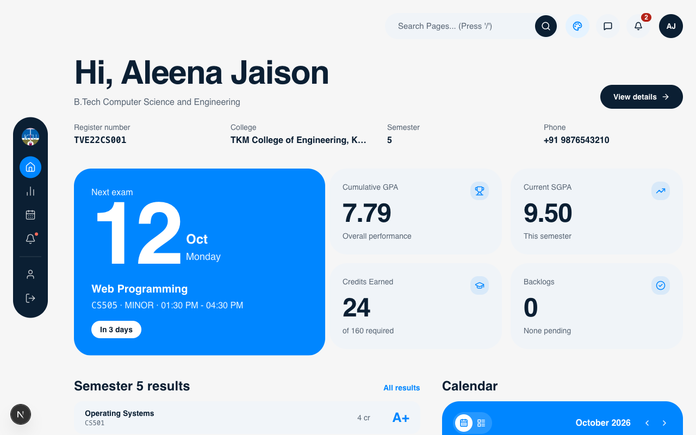
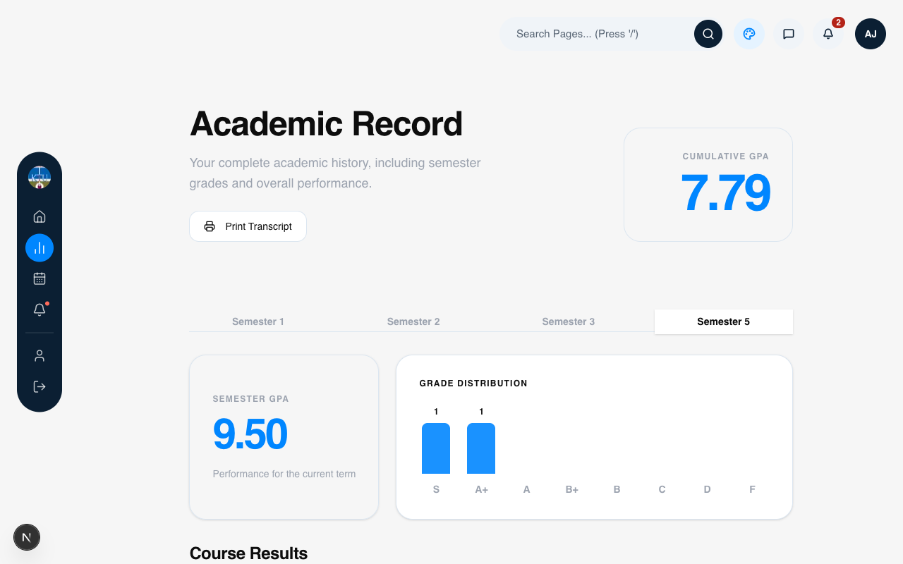
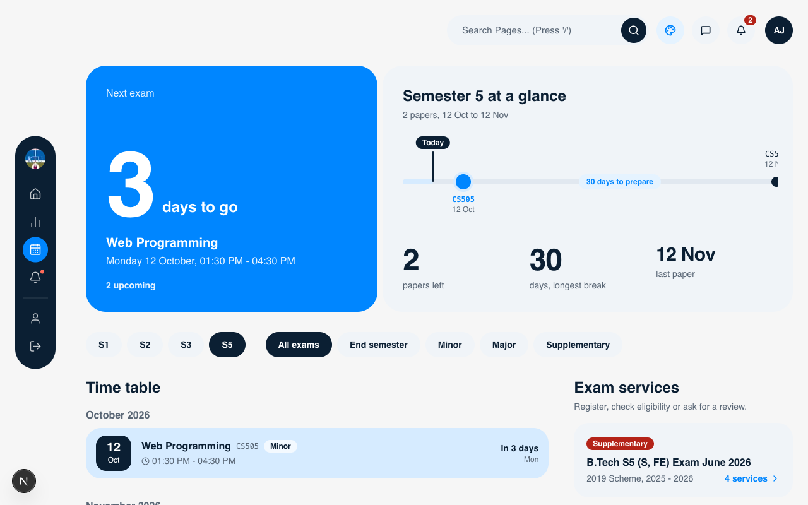

# KTU Student Portal Redesign

A beautiful, modern, and minimalist redesign of the KTU student portal. Designed with a focus on reducing cognitive load and surfacing the most important academic information at a glance.

## Screenshots

### 🏠 Home Dashboard
A clean, high-contrast overview of your current academic standing, next exam, and recent notifications.


### 📊 Results
A simplified, distraction-free view of your semester results with clear visual indicators for performance.


### 📅 Exams
An organized, chronological view of your upcoming examination schedule.


## Features

- **Minimalist Dashboard**: Clean, Swiss-inspired design using the Satoshi font to present data clearly.
- **Dynamic Theming**: Swap between a vibrant Blue theme and a calming Sage Green theme seamlessly with a UI toggle.
- **Academic Overview**: Quick glance at CGPA, current SGPA, credits earned, and pending backlogs.
- **Recent Results & Exams**: Clean tables and cards showing recent performance and upcoming schedules.
- **Notifications**: Subtle, non-intrusive alert system for university updates.
- **Responsive Sidebar**: Floating, rounded-rectangle sidebar navigation for focused workflows.

## Tech Stack

- **Framework**: [Next.js](https://nextjs.org/) (React, App Router)
- **Styling**: [Tailwind CSS v4](https://tailwindcss.com/)
- **Icons**: [Lucide React](https://lucide.dev/)
- **Database**: SQLite with [Drizzle ORM](https://orm.drizzle.team/)
- **Fonts**: Satoshi (via Fontshare)

## Getting Started

1. **Clone the repository:**
   ```bash
   git clone https://github.com/zidduhhere/ktu-re.git
   cd ktu-re
   ```

2. **Install dependencies:**
   ```bash
   npm install
   ```

3. **Run the development server:**
   ```bash
   npm run dev
   ```

4. **Open your browser:**
   Navigate to [http://localhost:3000](http://localhost:3000) to view the portal.
